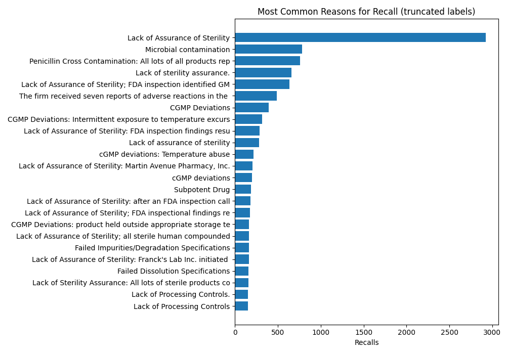

# Team FDA Recalls

## Team members
Grace Pitts and Alka Link

## Data Source
FDA recall data (drug and food recall)

## Challenges / Obstacles
This data choice presented us with issues in data gathering because there were not as many data entries as we had hoped. We had originally planned to just work with FDA drug recall data, although after ingesting the data, we found that there were only 17k records. We knew we needed more data, so we decided to also add FDA food recall data which got us almost to 50k entries, giving us way more to work with. Another problem we encountered with data gathering is that the API limits how much data you can skip so we couldn't download everything at once. There was some missing data, duplicates, and sometimes blocked requests which did not give us the easiest dataset to work with. In order to fix these problems, we changed how we downloaded and stored the data. We used smaller time ranges, filled in missing fields if possible, removed duplicates, and added a retry logic if we ran into an error. For tools, we used an API in order to get the data that we used from the FDA website. We also used DuckDB to help with data storage. We used a Docker container to avoid further software issues.

## Analysis
**Brief Analysis of FDA Recall Trends (2012-2025)**

FDA recall activity shows long term structural patterns that reveal where product risk is most heavily concentrated and how regulatory pressures have evolved. Across food and drug recalls it is clear that manufacturing and sterility failures, not small contamination events, drive the majority of recalls. The key insights of the FDA recall trends are as follows: sterility and cGMP failures dominate recalls, showing the systemic manufacturing issues. The most common recall reason by a wide margin is “Lack of Assurance of Sterility,” followed by many cGMP (current good manufacturing practice) failures. This suggests that recalls are a lot less about unexpected hazards and more about quality system failures, like improper documentation, temperature excursions, inadequate validation processes, etc. The real world implications of this is that these issues scale across entire production lots, which can increase regulatory burden. They are also preventable with better process control, which means that there could be a strong ROI for automated monitoring technology. Also, good recalls consistently outpace drug recalls, but the gap is narrowing in recent years. From 2012-2017, food recalls made up the majority of all recalls, but after 2018, food’s share declines steadily while drugs steadily rise. In addition to this, drug recalls have stayed relatively stable, while food recalls have sharp year-to-year spikes, which can be caused by supply chain shocks, outbreaks, or increased surveillance. In addition to this, recall frequency is seasonal in food but not in drugs. Monthly trends show that food recalls spike every spring/summer. This aligns with temperature related spoiler risks, peak agricultural distribution periods, and seasonal bacteria proliferation. Drugs lack this seasonality, which further supports that their recalls come from process failures and not environmental factors. Long term cumulative recalls rise steadily in both food and drugs, which suggests increased FDA oversight rather than declining product safety. These steady, linear curves can mean that there are more intense surveillance programs, better reporting infrastructure, and greater transparency rather than greater failures. This shows that recall counts alone cannot measure safety trends and it is important to take a closer look at the data. Finally, class II dominates the recalls, meaning that most hazards are moderate but widespread. Class II (medium risk) occurs twice as often as Class I (high risk), showing that most recalls are not about imminent danger but about compliance lapses that still have meaningful public health risks.

## Plot / Visualization


## GitHub Repository
https://github.com/gracepitts/fda-recalls

---

## Run in Docker

Run the FDA Recalls pipeline in Docker. This guide runs the pipeline in an isolated container so Prefect/Pydantic version conflicts in your host environment won't block execution.

Prerequisites
- Docker (or Docker Desktop) installed and running
- docker-compose (optional, included in Docker Desktop)

Build and run using docker-compose (recommended)

```bash
```

# Build image and run the pipeline service; uses MAX_RECORDS env var
docker compose up --build

To run with a different ingest size:

```bash
```

MAX_RECORDS=50000 docker compose up --build

Run just the container once (no compose):

```bash
```

# Build image
docker build -t fda-recalls:latest .

# Run (mount current dir so you keep plots/data/logs locally)
docker run --rm -v "${PWD}:/app" -v "${PWD}/data:/app/data" -v "${PWD}/logs:/app/logs" -v "${PWD}/plots:/app/plots" \
  fda-recalls:latest python scripts/run_pipeline.py --max-records 1000

Notes
- DuckDB is file-backed under `data/fda_recalls.duckdb` and will be persisted on your host via the volume mount.
- If you don't want to use Prefect orchestration inside the container you can pass `--no-prefect` to `scripts/run_pipeline.py`.

## Quickstart (local)

These steps reproduce the sequential pipeline I tested (no Prefect). They work on a clean machine when you follow the pinned `requirements.txt`.

1. Create and activate a virtual environment:

```bash
```

python -m venv .venv
source .venv/bin/activate

2. Install dependencies:

```bash
```

pip install -r requirements.txt

3. Run a quick smoke test (ingests 100 records):

```bash
```

python scripts/run_pipeline.py --no-prefect --max-records 100

4. Run a larger ingest (may be slow and hit OpenFDA API limits):

```bash
```

python scripts/run_pipeline.py --no-prefect --max-records 50000

5. Docker (alternative): run the sequential pipeline inside the container (service
  name `pipeline`):

```bash
```

docker compose run --rm pipeline python scripts/run_pipeline.py --no-prefect --max-records 100

Environment variable
- You can set `PIPELINE_MAX_RECORDS` to avoid typing `--max-records` on the CLI. For
  example:

```bash
```

PIPELINE_MAX_RECORDS=5000 python scripts/run_pipeline.py

This overrides the `MAX_RECORDS` value from `config.py` for that run. Passing
`--max-records` on the command line still takes precedence over the environment variable.

Notes on Prefect and reproducibility
- The Prefect orchestration file has been disabled in this repo (renamed to `scripts/pipeline_prefect.py.disabled`) to avoid import-time errors from Prefect/Pydantic version mismatches. The sequential runner (`--no-prefect`) is fully supported and was used for testing.
- To re-enable Prefect: restore the filename and ensure a compatible Prefect/Pydantic environment. Ask me and I can prepare a pinned Docker image for reproducible Prefect runs.

Logs and DB
- Logs are written to `logs/` (e.g. `logs/ingest.log`, `logs/process.log`). The repository ignores `logs/` so these files are not committed by default.
- The DuckDB file is at `data/fda_recalls.duckdb` and is persisted when running with the repository mounted.

---

If you'd like, I can also add a `Makefile` with convenient `make smoke` / `make ingest` targets, or prepare a small Docker Compose image that pins a working Prefect/Pydantic combination. Which would you prefer?
<<<<<<< HEAD
# Team FDA Recalls

## Team members
Grace Pitts and Alka Link

## Data Source
FDA recall data (drug and food recall)

## Challenges / Obstacles
This data choice presented us with issues in data gathering because there were not as many data entries as we had hoped. We had originally planned to just work with FDA drug recall data, although after ingesting the data, we found that there were only 17k records. We knew we needed more data, so we decided to also add FDA food recall data which got us almost to 50k entries, giving us way more to work with. Another problem we encountered with data gathering is that the API limits how much data you can skip so we couldn't download everything at once. There was some missing data, duplicates, and sometimes blocked requests which did not give us the easiest dataset to work with. In order to fix these problems, we changed how we downloaded and stored the data. We used smaller time ranges, filled in missing fields if possible, removed duplicates, and added a retry logic if we ran into an error.  For tools, we used an API in order to get the data that we used from the FDA website. We also used DuckDB to help with data storage. We used a Docker container to avoid further software issues. 


## Analysis
**Brief Analysis of FDA Recall Trends (2012-2025)**

FDA recall activity shows long term structural patterns that reveal where product risk is most heavily concentrated and how regulatory pressures have evolved. Across food and drug recalls it is clear that manufacturing and sterility failures, not small contamination events, drive the majority of recalls. The key insights of the FDA recall trends are as follows: sterility and cGMP failures dominate recalls, showing the systemic manufacturing issues. The most common recall reason by a wide margin is “Lack of Assurance of Sterility,” followed by many cGMP (current good manufacturing practice) failures. This suggests that recalls are a lot less about unexpected hazards and more about quality system failures, like improper documentation, temperature excursions, inadequate validation processes, etc. The real world implications of this is that these issues scale across entire production lots, which can increase regulatory burden. They are also preventable with better process control, which means that there could be a strong ROI for automated monitoring technology. Also, good recalls consistently outpace drug recalls, but the gap is narrowing in recent years. From 2012-2017, food recalls made up the majority of all recalls, but after 2018, food’s share declines steadily while drugs steadily rise. In addition to this, drug recalls have stayed relatively stable, while food recalls have sharp year-to-year spikes, which can be caused by supply chain shocks, outbreaks, or increased surveillance. In addition to this, recall frequency is seasonal in food but not in drugs. Monthly trends show that food recalls spike every spring/summer. This aligns with temperature related spoiler risks, peak agricultural distribution periods, and seasonal bacteria proliferation. Drugs lack this seasonality, which further supports that their recalls come from process failures and not environmental factors. Long term cumulative recalls rise steadily in both food and drugs, which suggests increased FDA oversight rather than declining product safety. These steady, linear curves can mean that there are more intense surveillance programs, better reporting infrastructure, and greater transparency rather than greater failures. This shows that recall counts alone cannot measure safety trends and it is important to take a closer look at the data. Finally, class II dominates the recalls, meaning that most hazards are moderate but widespread. Class II (medium risk) occurs twice as often as Class I (high risk), showing that most recalls are not about imminent danger but about compliance lapses that still have meaningful public health risks.


## Plot / Visualization


## GitHub Repository
https://github.com/gracepitts/fda-recalls 
=======
# fda-recalls

## Run in Docker

Run the FDA Recalls pipeline in Docker. This guide runs the pipeline in an isolated
container so Prefect/Pydantic version conflicts in your host environment won't block
execution.

Prerequisites
- Docker (or Docker Desktop) installed and running
- docker-compose (optional, included in Docker Desktop)

Build and run using docker-compose (recommended)

```bash
# Build image and run the pipeline service; uses MAX_RECORDS env var
docker compose up --build
```

To run with a different ingest size:

```bash
MAX_RECORDS=50000 docker compose up --build
```

Run just the container once (no compose):

```bash
# Build image
docker build -t fda-recalls:latest .

# Run (mount current dir so you keep plots/data/logs locally)
docker run --rm -v "${PWD}:/app" -v "${PWD}/data:/app/data" -v "${PWD}/logs:/app/logs" -v "${PWD}/plots:/app/plots" \
  fda-recalls:latest python scripts/run_pipeline.py --max-records 1000
```

Notes
- DuckDB is file-backed under `data/fda_recalls.duckdb` and will be persisted on your
  host via the volume mount.
- If you don't want to use Prefect orchestration inside the container you can pass
  `--no-prefect` to `scripts/run_pipeline.py`.

## Quickstart (local)

These steps reproduce the sequential pipeline I tested (no Prefect). They work on a
clean machine when you follow the pinned `requirements.txt`.

1. Create and activate a virtual environment:

```bash
python -m venv .venv
source .venv/bin/activate
```

2. Install dependencies:

```bash
pip install -r requirements.txt
```

3. Run a quick smoke test (ingests 100 records):

```bash
python scripts/run_pipeline.py --no-prefect --max-records 100
```

4. Run a larger ingest (may be slow and hit OpenFDA API limits):

```bash
python scripts/run_pipeline.py --no-prefect --max-records 50000
```

5. Docker (alternative): run the sequential pipeline inside the container (service
   name `pipeline`):

```bash
docker compose run --rm pipeline python scripts/run_pipeline.py --no-prefect --max-records 100
```

Environment variable
- You can set `PIPELINE_MAX_RECORDS` to avoid typing `--max-records` on the CLI. For
  example:

```bash
PIPELINE_MAX_RECORDS=5000 python scripts/run_pipeline.py
```

This overrides the `MAX_RECORDS` value from `config.py` for that run. Passing
`--max-records` on the command line still takes precedence over the environment
variable.

Notes on Prefect and reproducibility
- The Prefect orchestration file has been disabled in this repo (renamed to
  `scripts/pipeline_prefect.py.disabled`) to avoid import-time errors from Prefect/
  Pydantic version mismatches. The sequential runner (`--no-prefect`) is fully
  supported and was used for testing.
- To re-enable Prefect: restore the filename and ensure a compatible Prefect/Pydantic
  environment. Ask me and I can prepare a pinned Docker image for reproducible Prefect
  runs.

Logs and DB
- Logs are written to `logs/` (e.g. `logs/ingest.log`, `logs/process.log`). The
  repository ignores `logs/` so these files are not committed by default.
- The DuckDB file is at `data/fda_recalls.duckdb` and is persisted when running with
  the repository mounted.

---

If you'd like, I can also add a `Makefile` with convenient `make smoke` / `make ingest`
targets, or prepare a small Docker Compose image that pins a working Prefect/Pydantic
combination. Which would you prefer?
# fda-recalls

## Run in Docker

# Run the FDA Recalls pipeline in Docker

This guide runs the pipeline in an isolated container so Prefect/Pydantic version conflicts in your host environment won't block execution.

Prerequisites
- Docker (or Docker Desktop) installed and running
- docker-compose (optional, included in Docker Desktop)

Build and run using docker-compose (recommended)

```bash
# Build image and run the pipeline service; uses MAX_RECORDS env var
docker-compose up --build
```

To run with a different ingest size:

```bash
MAX_RECORDS=50000 docker-compose up --build
```

Run just the container once (no compose):

```bash
# Build image
docker build -t fda-recalls:latest .

# Run (mount current dir so you keep plots/data/logs locally)
docker run --rm -v "${PWD}:/app" -v "${PWD}/data:/app/data" -v "${PWD}/logs:/app/logs" -v "${PWD}/plots:/app/plots" fda-recalls:latest python scripts/run_pipeline.py --max-records 1000
```

Notes
- DuckDB is file-backed under `data/fda_recalls.duckdb` and will be persisted on your host via the volume mount.
- If you don't want to use Prefect orchestration inside the container you can pass `--no-prefect` to `scripts/run_pipeline.py`.
>>>>>>> c97614fe (Replace ingest implementation, add env override and auto-fallback for Prefect, update README Quickstart and env note, disable Prefect pipeline)
